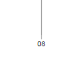
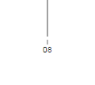

# Gridline tick gap issue

## Reproduction

* `git clone --recursive https://github.com/j-n-white/gridline-rendering-issue-example.git`
(using `--recursive` is important here, as it will initialise the client's _create-react-app_ submodule)

* `npm install`

* `npm start`

* Open [http://localhost:3000](http://localhost:3000) to view it in the browser. (This issue has been reproduced in Chrome 57.0.2987.133 and Firefox 52.0.2 (32-bit))

* Maximise the window. The graph will render correctly

 

* Restore the window to a non-fullscreen size. The graph will render with a small gap between the grid lines and the axis ticks.

 
